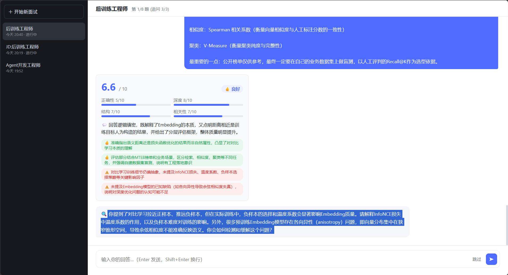

# 面试模拟 Agent 🎙️

[](https://github.com/yhw1374171546/interviewagent/actions)
[](https://github.com/yhw1374171546/interviewagent/actions)
[](https://www.python.org/)
[](LICENSE)

> 针对目标 JD 的 AI 全真模拟面试 — 帮你秋招拿 Offer。
>
> 技术栈: Python · asyncio · OpenAI/Anthropic API · ChromaDB · ReAct Agent

## 解决什么问题

**海投简历 → 收到面试 → 不知道会问什么 → 面试紧张发挥失常 → 挂了**

传统模拟面试的问题:
- 找朋友 mock：不专业、难以持续、反馈不系统
- 看面经刷题：和实际 JD 脱节、不知道面试官会追问什么
- 付费模拟面试：贵、时间不灵活

**本项目的解法**:
把你投的 JD 贴进去 → Agent 自动解析技术栈和考察重点 → 生成针对性题目 → 对你的回答实时打分 + 深度追问 → 输出完整评估报告。

## 核心能力

```
JD 解析      →   出题      →   追问      →   打分      →   报告
━━━━━━━━━━━━━━━━━━━━━━━━━━━━━━━━━━━━━━━━━━━━━━━━━━━━━━━━━━━━━━
提取技能要求    5 类题型      根据回答质量   4 维度评分    综合评估
技术栈/职责    针对性生成     逐层深挖      正确性/深度   优劣势分析
考察重点       匹配 JD       反例追问      结构/相关性    改进建议
```

### 五类题目

| 类型 | 比例 | 考察目标 | 示例 |
|------|------|---------|------|
| 🔧 技术基础 | 35% | 核心技能的掌握深度 | "GIL 是什么？什么场景下是瓶颈？怎么绕过？" |
| 🏗️ 场景设计 | 20% | 系统设计、架构思维 | "日活 100w 的实时排行榜怎么设计？" |
| 📂 项目深挖 | 20% | 实际项目经验深度 | "你最有挑战的项目是什么？怎么解决的？" |
| 💬 行为面试 | 15% | 软技能、团队协作 | "和 PM 意见冲突时你怎么处理？" |
| 💻 代码实操 | 10% | 现场编码能力 | "实现一个带过期时间的 LRU 缓存" |

### 智能追问策略

| 回答质量 | 追问策略 | 示例 |
|---------|---------|------|
| 太浅 | 追问细节 | "能展开说说具体是怎么实现的吗？" |
| 有漏洞 | 追问边界 | "如果 QPS 突然涨 10 倍，你的方案还 work 吗？" |
| 很好 | 提高难度 | "那更高阶的问题是..." |
| 抽象 | 要求举例 | "能举个你实际项目中的例子吗？" |

### 四维度评分

每道题从 **正确性(35%)**、**深度(25%)**、**结构(20%)**、**相关性(20%)** 四个维度打分，加权得出综合分。

### 最终报告

- 综合评分 + 等级评定
- 分维度得分雷达
- 3 个主要优势 + 3 个待提升项
- 针对性改进建议
- 面试结论（推荐通过 / 待定 / 不推荐通过）

## 项目结构

```
agent/
├── main.py                      # CLI 入口（Rich 美化 + 交互式 + 演示模式）
├── demo.py                      # 工程能力演示（0 API 调用：规则引擎+题库+沙箱）
│
├── interview/                   # 🎯 面试核心模块
│   ├── interviewer.py           #   面试主控 — 状态机驱动完整面试流程
│   ├── jd_parser.py             #   JD 解析 — 规则引擎 + LLM 兜底 (混合模式)
│   ├── skill_taxonomy.py        #   技能知识库 — 200+ 关键词 + 正则匹配引擎
│   ├── question_gen.py          #   题目生成 — 题库检索 + LLM 微调适配
│   ├── question_bank.py         #   题库系统 — 90+ 真题 + 倒排索引检索
│   ├── evaluator.py             #   答案评估 — 关键词匹配 + LLM 深度分析 (双引擎)
│   ├── code_judge.py            #   代码判题 — AST 白名单 + 沙箱执行 + 测试用例
│   ├── report.py                #   报告生成 — 统计计算 + LLM 综合评估
│   ├── output_validator.py      #   [v3] 输出校验 — JSON Schema + 格式修正
│   └── session_manager.py       #   [v3] 会话管理 — 持久化 + 跨会话对比
│
├── core/                        # ⚙️ LLM 基础设施层
│   ├── llm.py                   #   统一 LLM 接口 (OpenAI/Anthropic/Ollama)
│   │                            #     + Structured Output + Streaming + Prompt Caching
│   ├── agent.py                 #   ReAct Agent 主循环 (Think→Act→Observe)
│   ├── orchestrator.py          #   多 Agent 编排 (串行/并行/辩论)
│   ├── retry.py                 #   [v3] 重试机制 — 指数退避 + 熔断器 + 降级链
│   └── error_handler.py         #   [v3] 异常处理 — 分层容错 + 自动保存 + 健康检查
│
├── agents/                      # 🤖 预置 Agent
│   ├── coder.py                  #   编程助手 Agent
│   └── research.py              #   调研助手 Agent
│
├── tools/                       # 🔧 工具系统 (Function Calling)
│   ├── base.py                  #   @tool 装饰器 + ToolRegistry + Schema 自动推断
│   ├── code_exec.py             #   Python 沙箱执行
│   ├── search.py                #   网页搜索 + 内容抓取
│   └── file_ops.py              #   安全文件读写
│
├── memory/                      # 🧠 记忆模块
│   ├── context.py               #   滑动窗口 Token 管理
│   ├── context_optimizer.py     #   [v3] 上下文优化器 — 优先级保留 + 语义分块
│   ├── vector_store.py          #   ChromaDB 向量存储 + 语义检索
│   └── summarizer.py            #   长对话压缩摘要
│
├── web/                         # 🌐 [v4] Web Demo
│   ├── server.py                #   FastAPI 后端 — 会话/问答/历史 REST API
│   └── static/                  #   原生 HTML/CSS/JS（DeepSeek 风格界面）
│       ├── index.html           #   落地页 + 聊天页
│       ├── style.css            #   深色侧边栏 + 浅色聊天区
│       └── app.js               #   视图切换/历史管理/消息渲染
│
├── config/settings.py           # 全局配置 (环境变量驱动)
├── utils/                       # 日志 / Token 计数 / 成本估算
├── tests/                       # 测试
├── docs/                        # 文档
│   ├── architecture.md          #   架构设计文档
│   ├── optimization.md          #   优化手段全记录
│   └── interview_qa.md          #   面试 Q&A 参考 (13 道高频题)
└── requirements.txt
```

## 架构概览

```
                        main.py (CLI/Rich)
                             │
                     Interviewer (状态机)
                    INIT → WARMUP → QUESTION
                      → ANSWER → EVALUATE
                      → FOLLOW_UP? → NEXT_QUESTION
                      → CONCLUSION
                    ╱        │         ╲
             JDParser   QuestionGen   Evaluator
              (规则+LLM)   (题库+LLM)   (关键词+LLM)
                  ╲        │         ╱
                     core/llm.py
                ┌───── unified API ─────┐
                │  OpenAI │ Anthropic   │
                │  + retry + structured │
                │  + stream + cache     │
                └───────────────────────┘
```

## 关键设计亮点

| 亮点 | 说明 |
|------|------|
| **混合架构** | 规则引擎处理 70-90% 确定性工作（技能提取、题库匹配、关键词打分），LLM 只处理语义模糊的部分，大幅降低 API 成本 |
| **状态机模式** | `Interviewer` 用 7 个状态管理完整面试生命周期，业务逻辑与 UI 层完全解耦 |
| **双引擎评估** | 关键词匹配（客观、确定性）→ 正确性/相关性；LLM（语义分析）→ 深度/结构 + 追问决策 |
| **真实沙箱判题** | AST 白名单审计 → subprocess 隔离 → 真实测试用例 → pass/fail，而非 LLM 主观评分 |
| **题库检索系统** | 90+ 真题 + 倒排索引 + 标签匹配 + 分层选择（五类题型配比 + 难度分层），覆盖前端/大数据/中间件/AI·LLM 等 12 个方向 |
| **追问策略树** | 5 分类追问决策（deepen/challenge/upgrade/example/move_on），模拟真实面试官行为 |
| **多 LLM Provider** | 统一接口适配 OpenAI/Anthropic/Ollama，支持 Structure Output + Streaming + Prompt Caching |
| **生产级可靠性** | 指数退避重试 + 熔断器 + 降级链 + 自动保存恢复 + 系统健康检查 |
| **多 Agent 编排** | 支持串行管道、并行汇总、多方辩论三种协作模式 |
| **多会话管理** | JSON 持久化 + ChromaDB 向量存储 + 跨会话对比分析 + 面试中断恢复 |
| **Web Demo** | FastAPI + 原生 JS，DeepSeek 风格聊天界面，PDF 简历上传，历史会话置顶/重命名/删除，服务重启后断点续聊 |
| **Mock 降级** | 无 API Key 自动切换 MockLLMClient（确定性实现），Web 演示零配置可跑；LLMClient 抽象基类 + 多实现是适配器模式的体现 |

## 快速开始

```bash
cd agent
pip install -r requirements.txt
cp .env.example .env          # 填写 API Key（支持 DeepSeek/OpenAI/Claude/Ollama，见下方）
python main.py                # 交互式模拟面试 (CLI)
python main.py --test         # 演示模式（内置 JD + 预置回答）
python main.py --questions 10 # 自定义题目数量
python demo.py                # 工程能力演示（无需 API Key）
```

### LLM Provider 配置

| Provider | 配置 | 说明 |
|----------|------|------|
| **DeepSeek**（推荐国内用户） | `LLM_PROVIDER=openai` + `LLM_BASE_URL=https://api.deepseek.com/v1` + `LLM_MODEL=deepseek-chat` + `OPENAI_API_KEY=sk-xxx` | OpenAI 兼容协议，无需额外适配 |
| OpenAI | `LLM_PROVIDER=openai` + `LLM_MODEL=gpt-4o` | 官方 API |
| Claude | `LLM_PROVIDER=anthropic` + `ANTHROPIC_API_KEY=sk-ant-xxx` | 原生 Prompt Caching |
| Ollama 本地 | `LLM_BASE_URL=http://localhost:11434/v1` + `LLM_MODEL=qwen2.5:7b` | 免费、离线、隐私 |

无 Key 时全链路自动降级 Mock LLM（演示模式）。

### Web Demo（推荐体验方式）

```bash
uvicorn web.server:app --reload
# 浏览器打开 http://127.0.0.1:8000
```

- **上传 PDF 简历或粘贴文本** → 点击「开始对话」进入聊天界面
- **DeepSeek 风格界面**: 左侧边栏历史记录（置顶/重命名/删除，按时间排序）
- **无需 API Key 也能体验**: 未配置 Key 时自动降级到 Mock LLM 演示模式
- **断点恢复**: 面试中途刷新页面/重启服务，进度自动保存，可继续对话

### 界面预览

**落地页 — 上传简历 / 粘贴 JD**



**聊天界面 — 面试官提问 + 四维度评估卡 + 智能追问**


## 技术栈

| 层 | 技术选型 |
|---|---------|
| LLM | OpenAI GPT-4o / Anthropic Claude / Ollama 本地模型 |
| 编排 | 状态机模式 (7 状态) + ReAct Agent + 多 Agent 编排器 |
| 输出控制 | Structured Output (JSON Schema) + 输出校验 + 自动修正重试 |
| 可靠性 | 指数退避重试 + 熔断器 + 降级链 + 自动保存恢复 |
| 记忆 | 滑动窗口 Token 管理 + 优先级混合保留 + ChromaDB 向量存储 |
| 上下文 | 优先级评分 + 语义分块 + 混合保留策略 + 自适应预算 |
| 工具 | Function Calling + 沙箱代码执行 (AST 安全审计) |
| 会话 | JSON 持久化 + 会话索引 + 跨会话对比分析 |
| CLI | Rich 终端美化 + 流式输出 |

## 性能指标 (Benchmark)

`python benchmark.py` 可复现全部指标（离线、0 API 调用，v1 配置由代码模拟历史版本）：

| 指标 | v1 (优化前) | v2 (优化后) | 结论 |
|------|:---:|:---:|------|
| 规则解析覆盖率（8 份跨领域 JD 语料） | 52.4% | 69.8% | +17.4%（知识库 140→164 关键词） |
| 题库领域匹配率（每 JD 检索 8 题） | 73% | 92% | +19%（题库 38→91 题，前端 0%→100%、大数据 0%→100%） |
| 判题缺陷检出率（3 题 × 正确/缺陷实现） | 5/6 (83%) | 6/6 (100%) | 修复判题器不比较输出的真 bug + 补 recency 用例 |
| 评估异常拦截（7 类边界输入） | 全部调 LLM | 4/7 确定性层 0 调用拦截 | LLM 调用节省 57% |
| 单场面试 LLM 调用（3 题） | ≈7 次（全 LLM 方案） | 6 次（混合方案） | 出题/JD 解析主体全部规则化 |

## 评估器评测 (LLM-as-judge)

`python eval/judge_eval.py` 用人工标注数据集（10 题 × 高/中/低三档回答）评测评估器质量，报告见 [docs/eval_report.md](docs/eval_report.md)：

| 指标 | 定义 | 实测 | 说明 |
|------|------|:---:|------|
| 评分一致性 | 同一回答评 3 次的标准差 | **0.16** | 不稳定占比 0% |
| 评分准确性 MAE | LLM 评分 vs 人工标注的平均误差 | **0.94** | 修复中文匹配缺陷前为 1.50 |
| Pearson 相关 | LLM 评分与人工标注的排序一致性 | **0.991** | 修复前 0.923 |
| 追问贴题率 | 追问与题目/要点/回答的呼应率 | **100%** | 修复前 89% |

评测驱动了真实修复：高分回答曾被系统性低估（关键词引擎中文匹配缺陷），
eval→fix→re-eval 闭环后 MAE 下降 37%。

## 测试与覆盖率

```bash
python -m pytest tests/ -q                    # 192 个测试，全离线可跑（Mock/FakeLLM）
python -m pytest tests/ --cov=interview --cov=core --cov-fail-under=80
```

- **192 个测试**全部离线（Mock LLM / FakeLLM / 纯函数），CI 无真实 API 依赖
- **核心模块覆盖率 86%**（`interview/` 面试链路 + `core/` LLM 基础设施层），CI 以 80% 为门禁
- 覆盖：评估器健壮性、记忆、可观测性、LLM-as-judge 评测、流式输出（SSE）、
  JD 解析、题库检索、题目生成、状态机、会话管理、输出校验、代码判题、重试熔断、
  ReAct Agent、多 Agent 编排、异常处理

## 面试准备

本项目配套了完整的面试 Q&A 文档：
- **[面试 Q&A 参考](docs/interview_qa.md)** — 13 道高频面试题及详细回答
- **[优化手段全记录](docs/optimization.md)** — 14 项优化措施及量化效果
- **[架构设计文档](docs/architecture.md)** — 系统架构与设计决策

## TODO

- [x] Web Demo（DeepSeek 风格聊天界面 + 历史会话管理）
- [x] 模型路由（快模型高频调用 + 强模型关键节点）
- [ ] 语音输入 & 实时转写
- [ ] 面试录音回放 + 逐句分析
- [ ] 多岗位横向对比（面不同公司同一岗位）
- [ ] 知识库增强（RAG 面经 + 题库）
- [ ] 语义缓存（相似 JD 复用分析结果）
- [ ] 自适应难度（根据面试者表现动态调整）
- [ ] 评分一致性评测集（LLM-as-judge）
